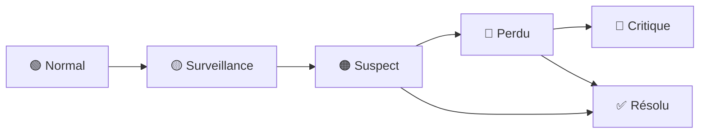

# 🔍 Service IA - Détection d'Objets Perdus

**Service intelligent de détection et surveillance d'objets perdus en temps réel**

[](https://python.org)
[](https://fastapi.tiangolo.com)
[](https://pytorch.org)
[](LICENSE)

## 🎯 Vue d'ensemble

Ce service utilise l'intelligence artificielle pour détecter et surveiller les objets perdus dans des espaces publics comme les aéroports, gares, centres commerciaux, etc. Il combine la détection d'objets en temps réel avec une logique métier intelligente pour identifier les objets abandonnés et générer des alertes automatiques.

### ✨ Fonctionnalités principales

- **🖼️ Détection sur images** : Analyse d'images statiques
- **🎬 Traitement vidéo** : Analyse complète de fichiers vidéo
- **📡 Streaming temps réel** : Détection en direct via WebSocket
- **🧠 IA intelligente** : 28 classes d'objets avec logique d'objets perdus
- **⚡ Performance optimisée** : Support GPU/CPU, cache intelligent
- **🚨 Alertes automatiques** : Génération d'alertes contextuelles
- **📊 Analytics** : Statistiques et tendances en temps réel

## 🏗️ Architecture

```
📁 ai-service/
├── 📁 app/                          # 🎯 CŒUR DE L'APPLICATION
│   ├── 📄 main.py                   # Point d'entrée FastAPI
│   ├── 📁 api/                      # 🌐 COUCHE API
│   │   ├── 📄 routes.py             # Routes principales
│   │   └── 📁 endpoints/            # Endpoints spécialisés
│   │       ├── 📄 image_detection.py    # 📸 Images statiques
│   │       ├── 📄 video_detection.py    # 🎬 Vidéos
│   │       ├── 📄 stream_detection.py   # 📡 Streaming temps réel
│   │       └── 📄 models.py             # 🤖 Gestion modèles
│   ├── 📁 core/                     # 🧠 LOGIQUE MÉTIER
│   │   ├── 📄 detector.py           # Détecteur principal
│   │   └── 📄 model_manager.py      # Gestionnaire modèles
│   ├── 📁 utils/                    # 🔧 UTILITAIRES
│   │   ├── 📄 image_utils.py        # Traitement images
│   │   └── 📄 box_utils.py          # Manipulation bounding boxes
│   ├── 📁 services/                 # 🎯 SERVICES MÉTIER
│   │   └── 📄 stream_service.py     # Service streaming
│   ├── 📁 schemas/                  # 📋 SCHÉMAS PYDANTIC
│   │   └── 📄 detection.py          # Schémas détection
│   └── 📁 config/                   # ⚙️ CONFIGURATION
│       └── 📄 config.py             # Configuration générale
├── 📁 storage/                      # 💾 STOCKAGE
│   ├── 📁 models/                   # 🏆 MODÈLES ENTRAÎNÉS
│   ├── 📁 temp/                     # Temporaire
│   └── 📁 cache/                    # Cache modèles
├── 📁 tests/                        # 🧪 TESTS
├── 📁 scripts/                      # 📜 SCRIPTS UTILITAIRES
└── 📁 logs/                         # 📋 LOGS
```

## 🚀 Installation Rapide

### Prérequis
- Python 3.8+
- 4GB RAM minimum (8GB recommandé)
- GPU NVIDIA optionnel (pour de meilleures performances)

### 1. Clone et Installation

```bash
# Clone du projet
git clone <your-repo-url>
cd ai-service

# Installation automatique
python scripts/start_service.py --install
```

### 2. Méthode Manuelle

```bash
# Installation des dépendances
pip install -r requirements.txt

# Création des répertoires
mkdir -p storage/{models,temp,cache} logs

# Configuration
cp .env.example .env  # Puis éditez selon vos besoins

# Démarrage
uvicorn app.main:app --reload
```

### 3. Docker (Recommandé)

```bash
# Build et démarrage
docker-compose up -d

# Ou avec monitoring
docker-compose --profile monitoring up -d
```

## 🎮 Utilisation

### 📱 Interface Web

Une fois le service démarré, accédez à :

- **API Documentation** : http://localhost:8000/docs
- **Interface Streaming** : http://localhost:8000/api/v1/stream/demo
- **Status Santé** : http://localhost:8000/health

### 🖼️ Détection d'Images

```python
import requests

# Upload d'un fichier
with open('image.jpg', 'rb') as f:
    response = requests.post(
        'http://localhost:8000/api/v1/detect/image',
        files={'file': f},
        data={
            'model_name': 'stable_epoch_30',
            'confidence_threshold': 0.5,
            'enable_lost_detection': True
        }
    )

result = response.json()
print(f"Objets détectés: {result['total_objects']}")
print(f"Objets perdus: {result['lost_objects']}")
```

### 🎬 Traitement Vidéo

```python
# Lancement du traitement
response = requests.post(
    'http://localhost:8000/api/v1/detect/video',
    files={'file': open('video.mp4', 'rb')},
    data={'frame_skip': 5, 'max_frames': 1000}
)

task_id = response.json()['task_id']

# Suivi du progrès
status_response = requests.get(
    f'http://localhost:8000/api/v1/detect/video/status/{task_id}'
)

print(f"Progrès: {status_response.json()['progress']}%")
```

### 📡 Streaming Temps Réel

```python
import asyncio
import websockets
import json
import base64
import cv2

async def stream_webcam():
    uri = "ws://localhost:8000/api/v1/stream/ws/client_123"
    
    async with websockets.connect(uri) as websocket:
        cap = cv2.VideoCapture(0)
        
        while True:
            ret, frame = cap.read()
            if not ret:
                break
            
            # Encodage base64
            _, buffer = cv2.imencode('.jpg', frame)
            frame_b64 = base64.b64encode(buffer).decode()
            
            # Envoi au serveur
            message = {
                "type": "frame",
                "data": frame_b64,
                "config": {"confidence_threshold": 0.5}
            }
            
            await websocket.send(json.dumps(message))
            
            # Réception résultat
            response = await websocket.recv()
            result = json.loads(response)
            
            if result['type'] == 'detection':
                objects = result['result']['total_objects']
                lost = result['result']['lost_objects']
                print(f"🔍 {objects} objets, {lost} perdus")
            
            elif result['type'] == 'alert':
                print(f"🚨 ALERTE: {result['alert']['message']}")

# Exécution
asyncio.run(stream_webcam())
```

## 🤖 Gestion des Modèles

### Modèles Supportés

Le service supporte plusieurs modèles optimisés pour différents cas d'usage :

| Modèle | Description | Performance | Vitesse | Usage |
|--------|-------------|-------------|---------|--------|
| `stable_epoch_30` | **Champion** - Modèle principal | 🟢 Haute | 🟡 Moyenne | Détection générale |
| `extended_28_classes` | Modèle étendu 28 classes | 🟢 Très haute | 🟡 Moyenne | Classification détaillée |
| `fast_stream` | Optimisé temps réel | 🟡 Moyenne | 🟢 Très rapide | Streaming |

### Ajout de Vos Modèles

1. **Placez vos fichiers `.pth`** dans `storage/models/`
2. **Modifiez la configuration** dans `app/config/config.py`
3. **Redémarrez le service**

```python
# Exemple d'ajout dans config.py
MODEL_CONFIGS = {
    'mon_modele': {
        'file': 'mon_modele.pth',
        'description': 'Mon modèle personnalisé',
        'performance': 'high',
        'speed': 'fast'
    }
}
```

## 📊 Logique Métier - Objets Perdus

### États d'un Objet



| État | Conditions | Durée | Actions |
|------|------------|-------|---------|
| **🟢 Normal** | Propriétaire présent | - | Surveillance passive |
| **🟡 Surveillance** | Immobile 30s | 30s | Surveillance renforcée |
| **🟠 Suspect** | Pas de propriétaire 30s | 30s-5min | Alerte préventive |
| **🔴 Perdu** | Abandonné > 5min | 5-30min | Alerte sécurité |
| **🔴 Critique** | Abandonné > 30min | 30min+ | Intervention prioritaire |

### Paramètres Configurables

```bash
# .env
SUSPECT_THRESHOLD_SECONDS=30      # Temps avant suspect
LOST_THRESHOLD_SECONDS=300        # Temps avant perdu (5min)
CRITICAL_THRESHOLD_SECONDS=1800   # Temps avant critique (30min)
OWNER_PROXIMITY_METERS=2.5        # Distance propriétaire (mètres)
```

## 🛠️ Configuration Avancée

### Variables d'Environnement

```bash
# Performance
USE_GPU=True                    # Utiliser GPU si disponible
BATCH_SIZE=4                   # Taille batch traitement
MAX_MEMORY_USAGE=0.8           # Limite mémoire GPU

# Streaming
MAX_CONNECTIONS=10             # Connexions WebSocket max
STREAM_FPS=15                  # FPS streaming
BUFFER_SIZE=30                 # Taille buffer frames

# Cache
CACHE_TTL=3600                 # TTL cache (secondes)
MAX_CACHE_SIZE=100             # Taille max cache

# Sécurité (production)
SECRET_KEY=your-secret-key
ACCESS_TOKEN_EXPIRE_MINUTES=30
```

### Configuration Modèles

```python
# app/config/config.py
MODEL_CONFIG = {
    'num_classes': 28,
    'image_size': (320, 320),
    'confidence_threshold': 0.5,
    'nms_threshold': 0.5,
    'classes': [
        'person', 'backpack', 'suitcase', 'handbag', 'tie',
        'umbrella', 'hair drier', 'toothbrush', 'cell phone',
        'laptop', 'keyboard', 'mouse', 'remote', 'tv',
        'clock', 'microwave', 'bottle', 'cup', 'bowl',
        'knife', 'spoon', 'fork', 'wine glass', 'refrigerator',
        'scissors', 'book', 'vase', 'chair'
    ]
}
```

## 📈 Monitoring et Analytics

### Métriques Disponibles

- **Performance** : Temps de traitement, FPS, usage mémoire
- **Détections** : Nombre d'objets, types, confiance
- **Alertes** : Fréquence, types, résolutions
- **Système** : Charge CPU/GPU, connexions actives

### Endpoints de Monitoring

```bash
GET /health              # Santé système
GET /stats               # Statistiques globales
GET /api/v1/models/health # Santé modèles
GET /api/v1/stream/status # État streaming
```

### Intégration Prometheus

```yaml
# docker-compose.yml
services:
  prometheus:
    image: prom/prometheus:latest
    ports:
      - "9090:9090"
    profiles:
      - monitoring
```

## 🧪 Tests

### Exécution des Tests

```bash
# Tests complets
python -m pytest tests/ -v

# Tests spécifiques
python -m pytest tests/test_api.py -v

# Tests avec couverture
pip install pytest-cov
python -m pytest tests/ --cov=app --cov-report=html
```

### Tests d'Intégration

```bash
# Démarrer le service de test
python scripts/start_service.py --port 8001 &

# Exécuter les tests d'intégration
python tests/integration_tests.py

# Arrêter le service de test
pkill -f "uvicorn.*8001"
```

## 🚀 Déploiement Production

### Docker Production

```bash
# Build image de production
docker build -t ai-service:prod .

# Déploiement avec monitoring
docker-compose --profile production --profile monitoring up -d
```

### Configuration Production

```bash
# .env.production
DEBUG=False
USE_GPU=True
WORKERS=4
LOG_LEVEL=WARNING

# Sécurité
SECRET_KEY=your-production-secret
CORS_ORIGINS=["https://yourapp.com"]

# Base de données
DATABASE_URL=postgresql://user:pass@db:5432/ai_service

# Cache Redis
REDIS_URL=redis://redis:6379
```

### Nginx Reverse Proxy

```nginx
# nginx/nginx.conf
upstream ai_service {
    server ai-service:8000;
}

server {
    listen 80;
    server_name your-domain.com;
    
    location / {
        proxy_pass http://ai_service;
        proxy_set_header Host $host;
        proxy_set_header X-Real-IP $remote_addr;
    }
    
    location /ws/ {
        proxy_pass http://ai_service;
        proxy_http_version 1.1;
        proxy_set_header Upgrade $http_upgrade;
        proxy_set_header Connection "upgrade";
    }
}
```

## 🐛 Dépannage

### Problèmes Courants

**❌ Modèles non trouvés**
```bash
# Solution
mkdir -p storage/models
# Placez vos fichiers .pth dans ce répertoire
```

**❌ Erreur CUDA**
```bash
# Vérifiez GPU
python -c "import torch; print(torch.cuda.is_available())"

# Forcer CPU
export USE_GPU=False
```

**❌ Port déjà utilisé**
```bash
# Changer le port
python scripts/start_service.py --port 8001
```

**❌ Mémoire insuffisante**
```bash
# Réduire batch size
export BATCH_SIZE=1
export MAX_CONNECTIONS=5
```

### Logs de Debug

```bash
# Logs détaillés
export LOG_LEVEL=DEBUG
python scripts/start_service.py

# Logs dans fichier
tail -f logs/ai_service.log
```

## 🤝 Contribution

### Structure des Commits

```bash
feat: nouvelle fonctionnalité
fix: correction de bug
docs: documentation
style: formatage code
refactor: refactoring
test: ajout tests
chore: maintenance
```

### Développement

```bash
# Setup environnement dev
python -m venv venv
source venv/bin/activate  # Linux/Mac
# ou venv\Scripts\activate  # Windows

pip install -r requirements.txt
pip install -r requirements-dev.txt

# Pre-commit hooks
pre-commit install

# Tests avant commit
python -m pytest tests/
python -m black app/
python -m flake8 app/
```

## 📄 Licence

Ce projet est sous licence MIT. Voir le fichier [LICENSE](LICENSE) pour plus de détails.

## 🆘 Support

- **📧 Email** : support@yourcompany.com
- **💬 Discord** : [Serveur Discord](https://discord.gg/yourserver)
- **📖 Documentation** : [Wiki](https://github.com/yourrepo/wiki)
- **🐛 Issues** : [GitHub Issues](https://github.com/yourrepo/issues)

## 🔄 Versions

- **v1.0.0** - Version initiale avec détection d'images et streaming
- **v1.1.0** - Ajout traitement vidéo et analytics
- **v1.2.0** - Optimisations performance et monitoring

---

**🎯 Fait avec ❤️ pour la sécurité et l'innovation**